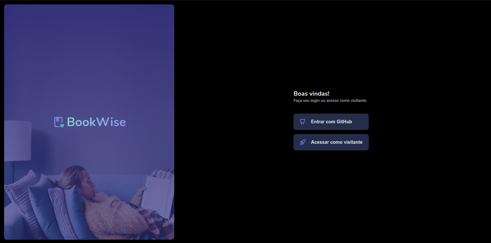
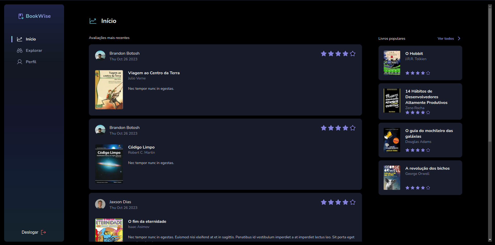
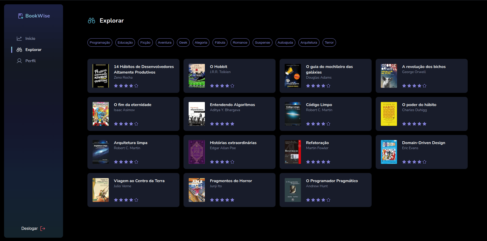
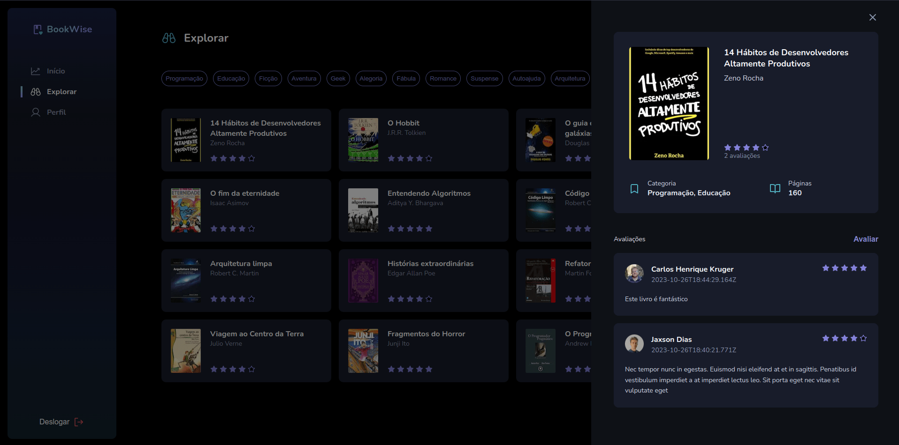
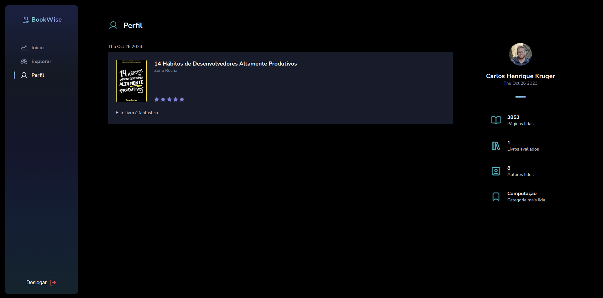

# BookWise

Fifth IgniteJS Bootcamp challenge: BookWise.
This is an application where it is possible to explore some books and review them.
You can Sign In in the application or use it as a guest.







## Getting Started

```bash

# Configure the environment variables file

# Copy the ".env.example" file and rename it to ".env"
# For the "GITHUB_CLIENT_ID" and "GITHUB_CLIENT_SECRET" variables, you need to generate it on your GitHub profile settings.
# For the "NEXTAUTH_SECRET" variable, you can generate a random string.

# Install dependencies
npm ci

# Run database migrations and seed (the database used is SQLite)
npx prisma generate
npx prisma db push
npx prisma db seed

# Run the application
npm run dev
```

## Tech stack

- Next.js
- NextAuth
- Prisma
